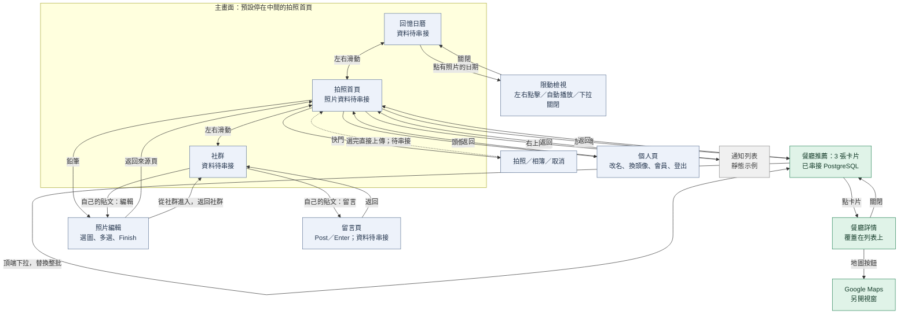
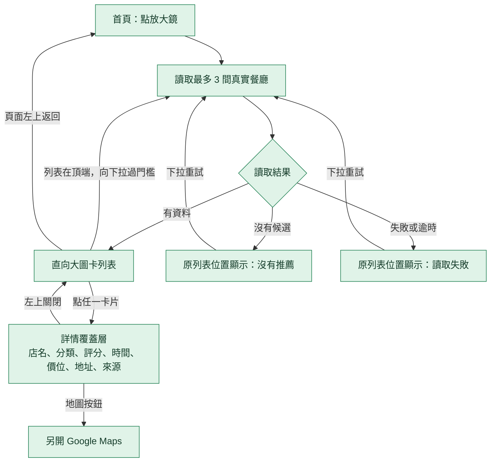
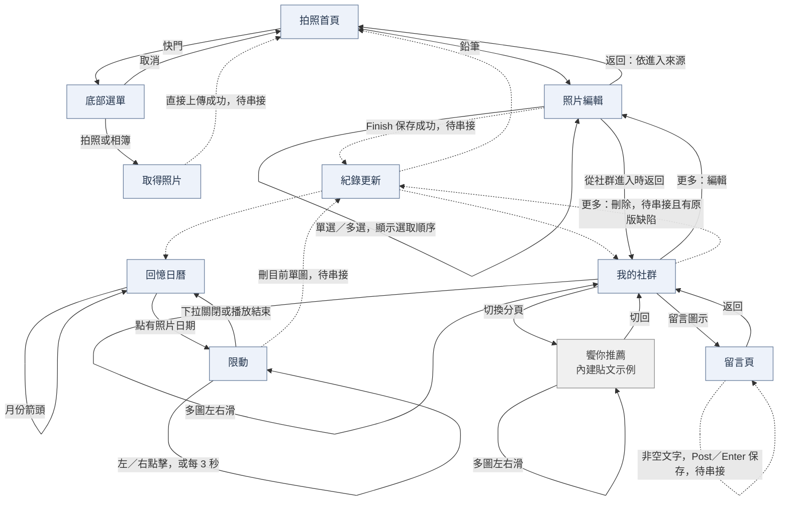
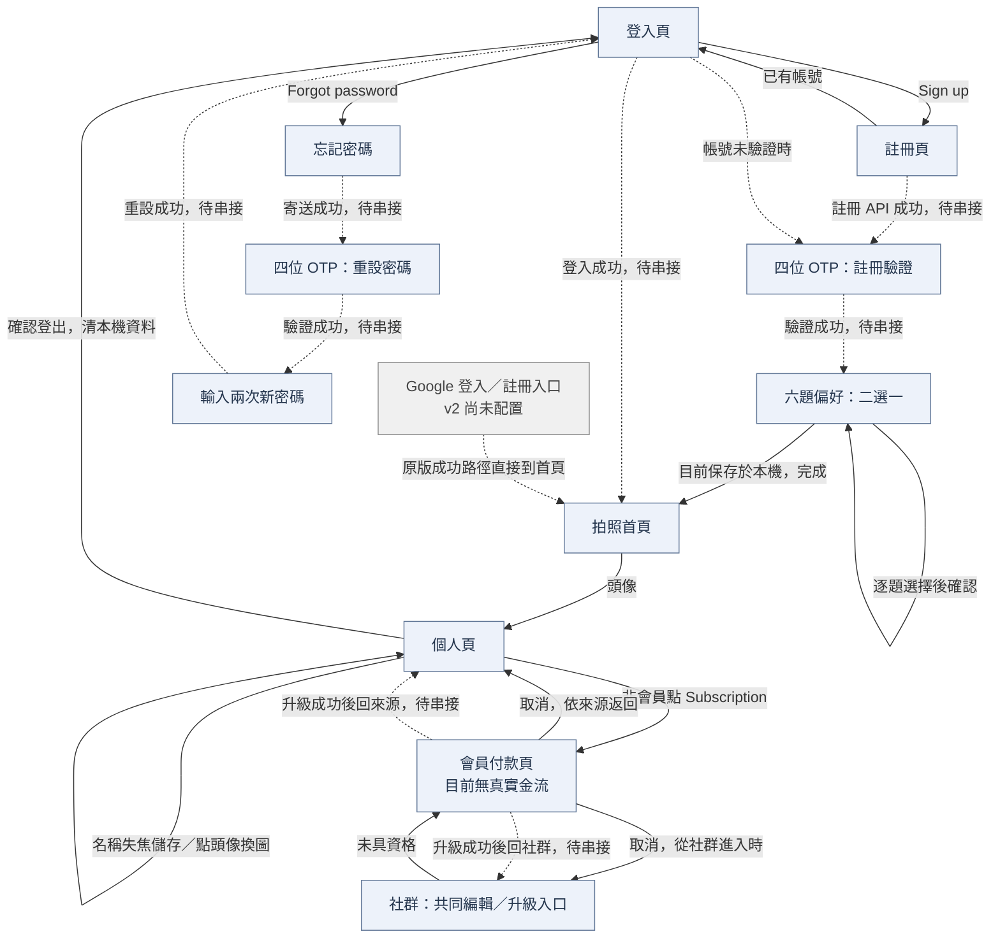

# 目前介面互動圖

更新：2026-09-10。依目前 v2開發/frontend 程式核對，呈現現有頁面與事件，不把開發規劃當成已完成能力。此文件只新增互動說明，沒有修改功能。

**讀圖方式：**綠色表示已串接的餐廳流程；藍色表示保留的前端操作（資料可能待串接）；灰色表示示例。實線為現有導航或畫面操作；虛線為程式中預留的成功／保存流程，目前缺少 v2 後端支援，不能視為已可完成。

## 1. 整體導航

- 主容器從左到右為「回憶日曆 → 拍照首頁 → 社群」，預設中間首頁。手指往左滑向右側頁面，往右滑向左側頁面；短滑會回彈。
- 目前主入口依本機登入標記導向登入頁或首頁，這不等於後端身分驗證已完成。
- 子頁的返回路徑依原版保留；照片編輯會依 from=home／social 返回不同位置。
- 限動或鎖定中的子頁會通知主容器停止側滑。手機巢狀手勢尚未完成實機驗收。

## 2. 餐廳推薦：目前已串接部分

- 下拉是整批替換，不追加列表，也沒有分頁按鈕。觸控與滑鼠皆有處理。
- 詳情讀取被點擊的卡片資料，不另外改成評論清單；底部區塊是資料來源說明。
- 缺照片使用明示的佔位圖，沒有提供的評分、價格、營業時間不造值。
- 資料少於 3 間就顯示實際數量；失敗後仍透過原本下拉恢復。
- 可直接開 search.html 核對公開餐廳資料，不表示其他頁面的帳號與私人資料已串接。

## 3. 照片、回憶與社群

**兩條新增路徑不同：**快門選完照片直接上傳；鉛筆先進編輯頁，再按 Finish。不能將兩條路徑合併。

目前的限制：

- 照片、紀錄與留言 API 尚未串接，虛線表示原前端預期的成功行為。跨頁更新通知雖存在，仍有格式不一致等缺陷。
- 原編輯頁的「取消捨棄」仍會離開；社群「刪整篇」目前只呼叫刪首張照片。這是待修缺陷，不是要求保留的產品互動。
- 圖片上的數字表示選取順序，沒有拖曳排序功能。
- 地點只是固定 Kaohsiung 狀態切換；朋友標記只是 Tagged 示意，沒有選人／選餐廳介面。
- 按讚只改目前頁面的記憶體；檢舉與已具資格的共同編輯只有提示。
- 饗你推薦的留言按鈕顯示唯讀提示，不會進入真正的留言頁。這裡推薦的是貼文，與放大鏡的餐廳推薦不同。

## 4. 帳號、偏好與會員

- 六題依序為：飯／麵、葷食／素食、中式／美式、清淡／重口味、餐廳／街頭美食、獨享／多人分享。未選不能前進；目前偏好尚未保存至 PostgreSQL。
- 個人頁的改名／頭像操作保留，但後端保存未完成。登出可以清本機資料，不能因此宣稱後端 session 已撤銷。
- 會員頁保留卡片欄位及返回來源的互動，尚無 v2 升級服務與真實金流。已具會員旗標時，個人頁 Subscription 不再導向付款。
- 通知頁是靜態列表，可上下捲動及返回；它不是聊天頁。首頁中央人物膠囊與多數設定列沒有已綁定的操作。
- 原版保留的重置／除錯入口不代表管理功能已完成，不列為正常使用流程。

## 核對依據

- [首頁與主容器](../frontend/index.html)、[首頁入口](../frontend/home.html)
- [餐廳推薦](../frontend/search.html)
- [照片編輯](../frontend/edit.html)、[回憶日曆](../frontend/memories.html)
- [社群](../frontend/social.html)、[留言](../frontend/comments.html)
- [帳號](../frontend/login.html)、[偏好](../frontend/onboarding.html)
- [個人頁](../frontend/profile.html)、[會員頁](../frontend/payment.html)
- [已完成／待完成狀態](frontend-baseline.md)

